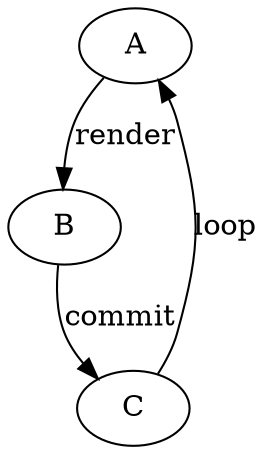

+++
title = "可视化"
date = "2025-01-12"
lastmod = "2025-01-12"
subtitle = "算法、调试与性能可视化工具盘点"
description = "整理算法可视化、代码调试与性能分析领域常用的可视化工具,涵盖 VisuAlgo、Python Tutor、Speedscope、Perfetto、D3.js 等,并给出选型建议。"
author = "小智晖"
authors = ["小智晖"]
categories = ["visual"]
tags = ["可视化", "算法可视化", "调试", "性能分析", "数据可视化"]
keywords = ["可视化", "算法可视化", "代码调试", "性能分析", "Flame Graph", "D3.js"]
toc = true
draft = false
+++

软件开发与计算机科学教学中,「可视化」是把抽象逻辑转化为可感知图形的有效手段。按照用途,可视化工具大致可分为三类:**算法可视化**(帮助理解数据结构与算法的执行过程)、**调试可视化**(帮助分析程序运行状态与调用关系)、**数据可视化**(用于绘制业务数据、网络拓扑等)。本文按这三类梳理常用工具。

## 算法可视化

算法可视化工具把排序、图论、动态规划等过程的中间状态以动画形式呈现,常用于教学和面试复习。

### VisuAlgo

[VisuAlgo](https://visualgo.net/en) 由新加坡国立大学 Steven Halim 副教授于 2011 年发起,定位为「通过动画可视化数据结构与算法」的免费教学网站,提供英文、中文、印尼文三种语言。

站点包含 24 个可视化模块,覆盖:

- 基础数据结构:数组、链表、二叉堆、哈希表
- 树形结构:二叉搜索树、AVL、线段树、树状数组(Fenwick Tree)、并查集
- 排序算法:冒泡、选择、插入、归并、快速、计数、基数排序
- 图算法:DFS/BFS、最小生成树(Prim、Kruskal)、单源最短路(Dijkstra、Bellman-Ford)、网络流
- 其他:位运算、递归树、后缀数组、凸包等

特色功能包括自定义输入、并排对比模式(Juxtaposition)和在线测验系统,适合配合《Competitive Programming》教材使用。

### Algorithm Visualizer

[Algorithm Visualizer](https://algorithm-visualizer.org/) 是一个基于 React 的开源交互平台,在 GitHub 上拥有约 4.8 万 star,采用 MIT 协议。它的最大特点是「代码即动画」——通过为多种语言提供 Tracer 库,将开发者编写的算法代码直接渲染为可视化命令,而不是预录的动画。项目拆分为 web 应用、server、算法仓库和多种语言的 tracer 等多个子仓库,可自行部署。

### Visual Sorting

[Visual Sorting](https://github.com/mszula/visual-sorting) 是一个专注于排序算法的开源 Web 工具,基于 Svelte 与 SvelteKit 构建,灵感来自 Timo Bingmann 的《The Sound of Sorting》。它支持 19 种排序算法,包括:

- 经典比较类:冒泡、插入、选择、归并、快速、堆、希尔排序
- 非比较类:计数排序、LSD/MSD 基数排序
- 冷门变种:侏儒、圈、鸡尾酒、煎饼、Stooge、Bogo 排序等

特色是每根柱子的高度对应一个音高,在演示算法的同时生成可听的「排序之声」,并提供并排比较、步进、键盘快捷键等交互。在线 Demo 部署在 GitHub Pages。

## 编程调试可视化

调试可视化关注的是「程序在运行时到底发生了什么」——包括内存状态、调用栈、CPU 耗时分布等。

### Python Tutor

[Python Tutor](https://pythontutor.com/) 由 Philip Guo 开发,定位为「模拟编程入门课教师在黑板上画图」的在线工具。尽管名字中带 Python,它实际支持多种语言:

- Python(3.11 / 3.6 / 2.7)
- Java
- C(C17 + GNU 扩展)
- C++(C++20 + GNU 扩展)
- JavaScript(ES6)

核心能力是**逐行步进**与**运行时状态可视化**:每一执行步骤都展示当前的函数调用栈、堆对象及其引用关系,非常适合用来讲解指针、递归、对象别名等概念。对 C/C++ 的可视化借助 Valgrind 完成内存安全的运行时遍历,能够显示未初始化内存和越界错误。

### 性能分析可视化(Profiling)

CPU 性能分析最常见的可视化形式是 **火焰图(Flame Graph)**,由 Brendan Gregg 推广。横轴表示调用栈的样本数,纵轴表示调用深度,宽矩形代表耗时较多的函数。

- **Chrome DevTools Performance 面板**:浏览器内置的录制与分析工具,在 Performance 标签页录制后可查看 JavaScript 的火焰图(Flame Chart),按脚本/渲染/绘制等分类着色。
- **[Speedscope](https://www.speedscope.app/)**:Jamie Wong 开发的开源(MIT)Web 端 profile 查看器,支持 Chrome、Firefox、Safari、Node.js、py-spy、pprof、async-profiler、Instruments、`perf` 等众多格式。提供 Time Order(时间顺序)、Left Heavy(相同栈合并)、Sandwich(函数自底向上表)三种视图,所有数据在浏览器本地处理,不上传服务器。
- **[Perfetto](https://perfetto.dev/)**:Google 开源的系统级 trace 平台,适用于 Linux 与 Android。提供基于 SQL 的 trace processor 和浏览器端 Trace Viewer(`ui.perfetto.dev`),可读取 ftrace、Android Systrace、Chromium JSON 等格式,擅长分析调度、CPU 频率、任务切换延迟以及原生/Java 堆分配。

```bash
# 使用 perf 采集 CPU 栈,再用 FlameGraph 工具链渲染
perf record -F 99 -g -- ./your_app
perf script | stackcollapse-perf.pl | flamegraph.pl > profile.svg
```

对于 Node.js 与浏览器前端应用,直接用 Speedscope 打开 Chrome 导出的 `.cpuprofile` 即可。

## 数据与图形可视化

当需要把业务数据或结构关系呈现给最终用户时,通常会借助可视化库:

- **[D3.js](https://d3js.org/)**:Mike Bostock 创建、现由 Observable 维护的 JavaScript 库,ISC 协议。直接操作 DOM,通过 scales、shapes、layouts 等模块组合出几乎任意自定义图表(力导向图、treemap、 choropleth 等),灵活度极高但学习曲线陡峭。
- **[Graphviz](https://graphviz.org/)**:老牌开源图形可视化软件,通过 `dot`、`neato`、`fdp` 等布局引擎将 DOT 文本语言描述的图渲染为 SVG/PDF/PNG,常用于绘制依赖图、数据库 schema、状态机。



## 选型建议

| 场景 | 推荐工具 |
|------|---------|
| 学习/教学数据结构与算法 | VisuAlgo、Algorithm Visualizer |
| 直观感受排序过程 | Visual Sorting |
| 讲解或排查代码执行流程 | Python Tutor |
| 浏览器/Node.js 性能分析 | Chrome DevTools、Speedscope |
| Linux/Android 系统级 trace | Perfetto |
| Linux 原生 CPU profile | `perf` + FlameGraph |
| 自定义数据图表 | D3.js |
| 结构图/依赖图/状态机 | Graphviz |

可视化工具的价值在于降低认知成本:用一幅图代替千言万语的描述。选型时,先明确目标(是讲解、调试还是交付给用户),再根据运行环境与目标语言匹配对应工具,通常能快速收敛到合适的选择。

## 参考

- [VisuAlgo — 数据结构与算法可视化](https://visualgo.net/en)
- [Algorithm Visualizer 官网](https://algorithm-visualizer.org/)
- [Algorithm Visualizer GitHub 组织](https://github.com/algorithm-visualizer)
- [Visual Sorting(GitHub)](https://github.com/mszula/visual-sorting)
- [Python Tutor 官网](https://pythontutor.com/)
- [Python Tutor Visualize 页面](https://pythontutor.com/visualize.html)
- [Speedscope 官网](https://www.speedscope.app/)
- [Speedscope GitHub](https://github.com/jlfwong/speedscope)
- [Perfetto 官网](https://perfetto.dev/)
- [Perfetto Trace Viewer](https://ui.perfetto.dev/)
- [Flame Graph(Brendan Gregg)](https://github.com/brendangregg/FlameGraph)
- [D3.js 官网](https://d3js.org/)
- [Graphviz 官网](https://graphviz.org/)
